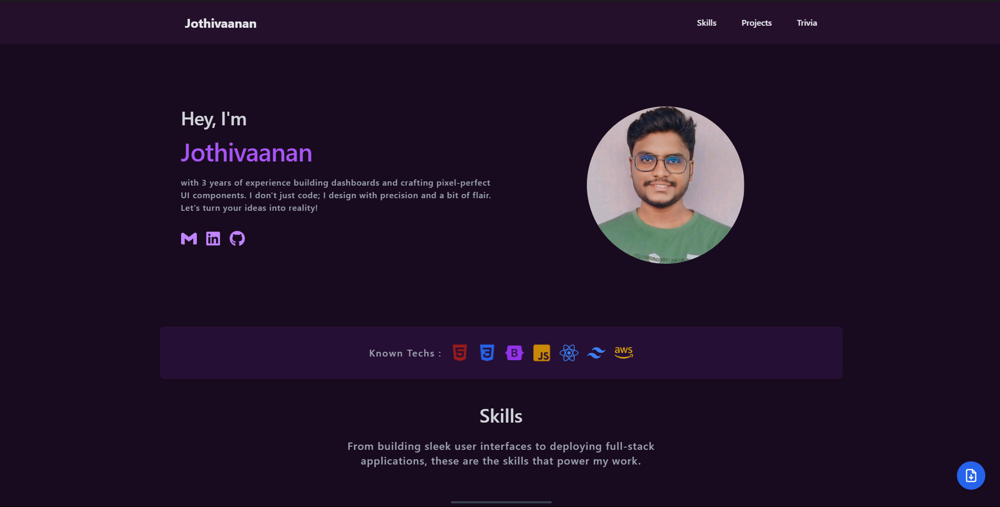

# My Portfolio Website

Welcome to my portfolio website! This project showcases my skills, experience, and journey as a React developer. The website is designed with a modern, responsive UI, featuring smooth animations and built using **React** and **TailwindCSS**.

## Sections

### 1. Hero
The Hero section introduces who I am and what I do, giving a quick snapshot of my work experience and development expertise.

### 2. Journey
The Journey section highlights my significant projects, from early ventures to professional work. Each project is accompanied by a brief description, explaining its functionality and importance in my career growth.

### 3. Skills
This section provides a comprehensive overview of my technical skills, focusing on **React**, **JavaScript**, **CSS frameworks**, and various tools I’ve mastered over the years.

### 4. Trivia
A fun and quirky section that adds a bit of humor to the portfolio, sharing some funny and relatable facts about my development journey and hobbies.

## Features
- **Built with React**: The entire site is crafted with React, showcasing reusable components.
- **TailwindCSS**: I’ve used TailwindCSS to style the site with a clean, modern look, while ensuring it's fully responsive.
- **Animations**: Leveraging new CSS animation properties and Framer Motion for smooth transitions and engaging interactions.
  
## Technologies
- **React.js**
- **TailwindCSS**
- **Framer Motion**
- **CSS Animations**

Feel free to explore the site and download my resume using the floating action button!

-----------------------------------------------------------------------------------------------------------------------------------------

# Firebase deploy help
1. npm run build
2. firebase deploy
